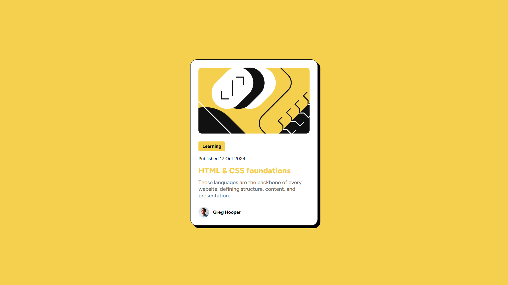
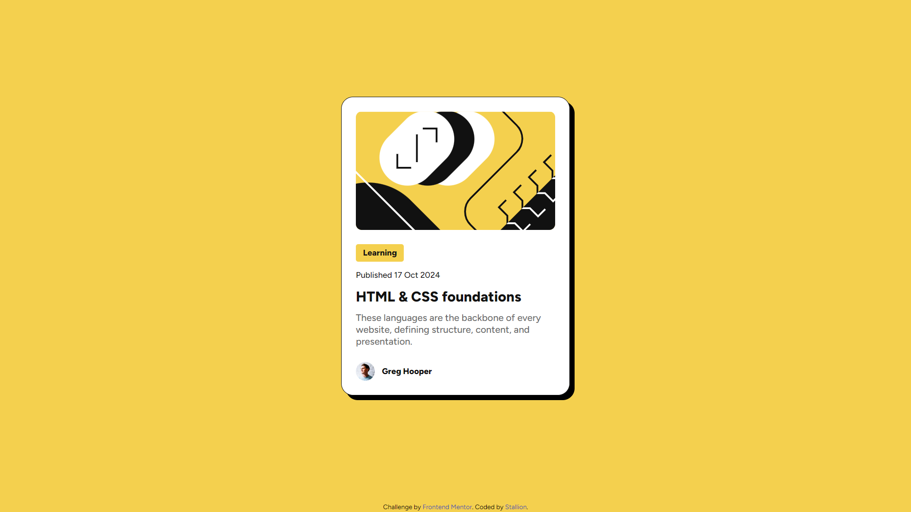
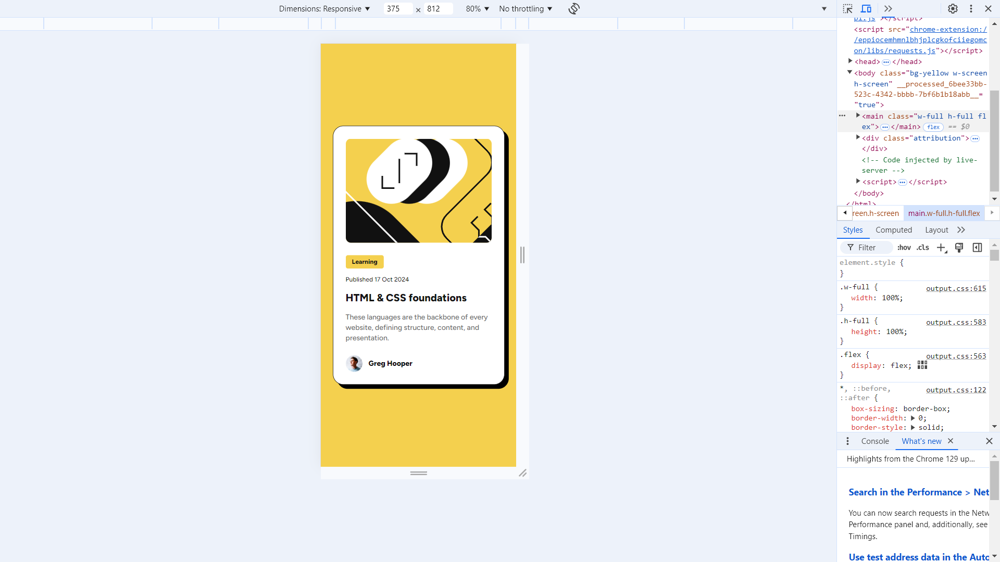

# Frontend Mentor - Blog preview card solution

This is a solution to the [Blog preview card challenge on Frontend Mentor](https://www.frontendmentor.io/challenges/blog-preview-card-ckPaj01IcS). Frontend Mentor challenges help you improve your coding skills by building realistic projects. 

## Table of contents

- [Overview](#overview)
  - [The challenge](#the-challenge)
  - [Screenshot](#screenshot)
  - [Links](#links)
- [My process](#my-process)
  - [Built with](#built-with)
- [Author](#author)

## Overview

### The challenge

Users should be able to:

- See hover and focus states for all interactive elements on the page

### Screenshot

### Links

- Solution URL: [GitHub](https://github.com/ThatHorseRep/blog-preview-card-main-with-Tailwind.git)
- Live Site URL: [Vercel](https://blog-preview-card-main-with-tailwind.vercel.app/)

## My process

### Built with

- Semantic HTML5 markup
- CSS custom properties
- Flexbox
- CSS Grid
- Mobile-first workflow
- [Tailwind](https://tailwindcss.com/docs/) - For styles

## Author

- Website - [Stallion](https://linktr.ee/thathorserep)
- Frontend Mentor - [@ThatHorseRep](https://www.frontendmentor.io/profile/ThatHorseRep)
- X - [@ThatHorseRep](https://www.x.com/ThatHorseRep)